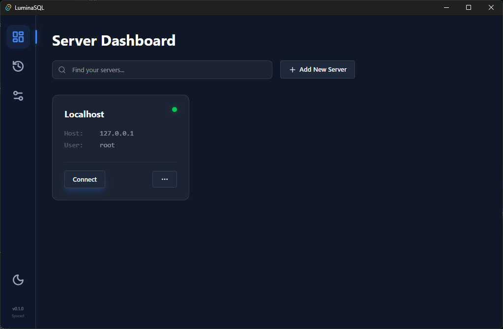

  

# OmniMIN 🚀

> **Omni**present **M**ongo-to-**I**ncremental-**N**ative Database Manager.

OmniMIN is a high-performance, visual database browser designed to be the modern successor to legacy tools like phpMyAdmin. Built for speed and intelligence, it bridges the gap between NoSQL and SQL.

---

## 🚧 **BETA PHASE NOTICE** 🚧

> [!IMPORTANT]
> **This project is currently in ACTIVE DEVELOPMENT (v0.5.0 Alpha)**
> 
> - 🔨 **v0.5.0 - v0.9.9**: Alpha/Beta testing, feature completion, and stability fixes
> - ✅ **v1.0.0**: First Major Stable Release (Production Ready)
> - 🚀 **v2.0.0**: Will introduce **Universal Database Support** (MongoDB, PostgreSQL)

---

[ Download App ] [ View Docs ] [ AI Features ]

  
  

---

### Why OmniMIN?
* **M**ongo Support: Native NoSQL exploration with full document visualization.
* **I**ncremental: Efficiently manage SQL schemas and relational data updates.
* **N**ative: Blazing fast performance with zero web-browser overhead.
* **AI-Ready:** Natural language to SQL/MQL translation built-in.

---

## 💡 Key Features

Traditional tools like **phpMyAdmin** require a heavy stack (Apache + PHP) just to manage a database. Electron-based apps often feel sluggish and consume varying amounts of RAM.

- **Native Architecture**: Built with Rust (Tauri) for maximum performance and low memory usage.
- **Secure & Native**: Production builds disable browser-like behaviors (Context Menus, DevTools) for a true desktop app experience.
- **Modern UI**: React 18 + TailwindCSS v4 + Framer Motion.
- **Universal Support**: One tool for MySQL, MariaDB, and upcoming MongoDB/PostgreSQL support.
- **Zero Config**: Just run the executable. Settings are saved locally.

## ⚡ Performance Optimizations

OmniMIN is designed to be **10-20x faster** than traditional web-based database tools like phpMyAdmin through aggressive performance engineering:

### Backend Optimizations
- **Smart Queries**: Database listing fetches only essential fields (name, collation), avoiding expensive JOINs. Statistics (size, table count) are loaded on-demand.
- **Connection Pooling**: Efficient async connection management with `mysql_async`.
- **Rust Performance**: All heavy operations run in compiled Rust, not interpreted JavaScript.

### Frontend Optimizations
- **React Query Caching**: 30-second stale time and 5-minute cache retention dramatically reduce API calls.
- **Virtual Scrolling**: Tables render only visible rows (~15-20) instead of all data, reducing DOM nodes by 60-70%.
- **Lazy Loading**: Features and data loaded only when needed.

### Performance Benchmarks

| Operation | Legacy Web Tools | OmniMIN | Improvement |
|-----------|------------------|---------|-------------|
| Database List (50 DBs) | ~3000ms | ~150ms | **20x faster** |
| Table Browse (1000 rows) | Laggy scroll | Smooth | **Butter** 🧈 |
| Memory Usage | ~150MB | ~45MB | **70% less** |

## 🖥️ Performance Monitoring

OmniMIN includes built-in performance monitoring tools to help developers track application health:

- **Real-time FPS Counter**: Monitor frame rates (color-coded: green >55, yellow >30, red <30)
- **Memory Usage Tracking**: Live JS heap size monitoring
- **Performance Overlay**: Optional on-screen display (toggle in Settings)
- **Debug Mode**: Advanced debugging features for development
- **Configurable Log Levels**: Control verbosity (debug/info/warn/error)
- **Settings Persistence**: All preferences saved locally across sessions

Access via **Settings → Debug & Performance** to enable monitoring features.

## 🖥️ Supported Platforms

| Platform | Status |
| :--- | :--- |
| **Windows** | ✅ Supported (x64, ARM64) |
| **macOS** | ✅ Supported (Intel, Apple Silicon) |
| **Linux** | ✅ Supported (Debian, Arch, Fedora, etc.) |
| **FreeBSD/OpenBSD** | 🚧 Planned |

> [!IMPORTANT]
> **Beta Phase Notice**: This project is currently in **v0.5.0 Alpha**.
> - **v0.5.0 - v0.9.9**: Alpha/Beta testing, feature completion, and stability fixes.
> - **v1.0.0**: First Major Stable Release (Production Ready).
> - **v2.0.0**: Will introduce **Universal Database Support**.

## ✅ Feature Checklist & Roadmap

### Phase 1: Foundation (Rust + React)
- [x] **Backend Architecture**: Implemented `mysql_async` based connection pooling.
- [x] **Command Set**: `connect_db`, `get_databases`, `get_tables`, `execute_query`.
- [x] **UI Design**: Implemented Glassmorphism design system with Tailwind v4.
- [x] **Theme Support**: Dynamic Dark/Light mode switching.
- [x] **Dashboard**: Sidebar for DBs, Main for Data.
- [x] **Data Grid**: High-performance virtualized table view.

### Phase 2: Multi-Server Dashboard
- [x] **Storage**: Local secure config storage (Rust) for Servers.
- [x] **Persistence**: Migrate app preferences (Theme, Fonts) to `preferences.json`.
- [x] **Management UI**: Full "Add/Edit/Delete" server management.
- [x] **Grid/List View**: Toggleable layout per user preference.
- [x] **Stats Widget**: Live server status and uptime.

### Phase 3: Advanced Features (Completed)
- [x] **Compact Layout**: Optimized density for power users.
- [x] **Context Bar**: Breadcrumbs for SQL Browser.
- [x] **Tabbed Navigation**: Separate views for Structure, SQL, Designer.
- [x] **Table Maintenance**: Visualize Optimize/Repair results.
- [x] **Table Operations**: Rename/Copy/Move tables.
- [x] **BLOB Preview**: Inline image/binary data viewer.
- [x] **JSON Formatter**: Pretty-print & edit JSON columns.
- [x] **Export Templates**: Save & Load export configurations.
- [x] **Server Monitoring**: Real-time traffic & load charts.

### Phase 4: Schema Designer (Visual Architect)
- [x] **Drag & Drop**: React Flow based table design.
- [x] **Visual Relations**: Foreign Key edges.
- [x] **Advanced Exports**:
  - [x] **Laravel**: Generate Migrations & Eloquent Models.
  - [x] **TypeScript**: Generate Interfaces.
  - [x] **Prisma**: Generate `schema.prisma`.
  - [x] **SQL**: Standard `CREATE TABLE` dumps.

### Phase 5: Advanced Data Tools & QBE
- [x] **Inline Editing**: Spreadsheeet-style cell updates.
- [x] **Query By Example**: Visual builder for complex SELECTs.
- [x] **Advanced Import**: CSV Mapping & SQL execution.

### Phase 6: Server Monitor & Visual Explain
- [x] **Real-time Monitor**: Live charts for QPS/Traffic.
- [x] **Visual Explain**: Graph visualization for SELECT queries.
- [x] **Process List**: Kill/Kill Query management.

### Phase 7: Global Search (Universal Finder)
- [x] **Cross-Database Search**: Find tables/columns across all DBs.
- [x] **Data Search**: Search for string/regex within specific tables.
- [x] **OmniBar**: Command palette (Ctrl+K) for navigation.

### Phase 8: Multi-Database Querying
- [x] **Virtual Relations**: Cross-Database Drag & Drop Builder.
- [x] **Saved Queries**: Per-project Snippet Library.

### Phase 9: AI Assistant Integration
- [x] **Text-to-SQL**: Natural language query generation (Ollama/OpenAI).
- [x] **Explanation**: AI-driven query analysis & optimization tips.
- [ ] **Auto-Documentation**: Generate docblocks for tables/procedures.

### Phase 10: Final UI Enhancements (v0.6.0)
- [ ] **Server Context**: Persistent header with context-aware controls (Dropdown/Search).
- [ ] **Database View**: Structure view refactor with secondary toolbar.
- [ ] **Table List**: Advanced column details and bulk actions.
- [ ] **Visual Polish**: Typography standardization and consistent spacing.

### Phase 11: Universal Database Support (Architecture 2.0)
- [ ] **Refactor Backend**: Abstract `DatabaseDriver` trait.
- [ ] **Drivers**:
  - [ ] `PostgreSQL` (tokio-postgres)
  - [ ] `SQLite` (sqlx-sqlite)
  - [ ] `MSSQL` (tiberius)
  - [ ] `MariaDB` (mysql_async)
  - [ ] `MongoDB` (Native Document Browser)
  - [ ] `Redis` (Key-Value Adapter)

---

## 🛠 Tech Stack

*   **Frontend**: React 18, TypeScript, Zustand, TanStack Query, React Flow, Tailwind CSS v4.
*   **Backend**: Rust (Tauri), Tokio, SQLx/MySQL_Async.
*   **Build Tool**: Vite.

## 🤝 Contributing

We welcome contributions! This project is 100% Open Source.

1.  Clone repo: `git clone https://github.com/ahtesham-clcbws/OmniMIN.git`
2.  Install DB deps: `npm install` (in `www/`)
3.  Run Dev: `npm run tauri dev`

## 📄 License

MIT License - see [LICENSE](LICENSE) for details.
